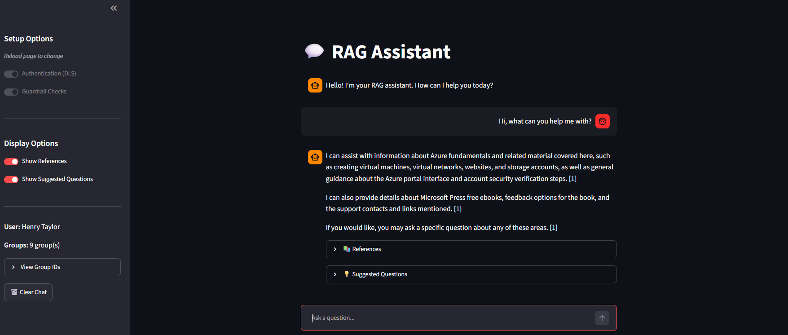

# Azure RAG Accelerator

A modular Retrieval-Augmented Generation (RAG) solution built on Azure AI services. Implements document-level security, content moderation guardrails, query refinement, and citation management. Designed as an accelerator to speed up production RAG deployments.

> NOTE: This is an accelerator/reference implementation, not a production-ready product. Its designed for local use, connecting with Azure services. Customize for your specific use case and or production loads.



## 📋 Core Components
- Entry: Streamlit chat application front-end, CLI, API from backend
- LLM: Azure Foundry for chat completion and query refinement
- Model Agnostic: Uses `azure-ai-inference` SDK - on Foundry, swap OpenAI, Anthropic, Llama, Mistral, Phi, or others models without code changes.
- Search: Azure AI Search with hybrid (vector + keyword) and semantic ranking
- Embeddings: Azure AI Foundry embeddings for vector search
- Guardrails: Content Safety API for hate/violence/sexual/self-harm detection + jailbreak prevention + on topic detection
- Security: Document-Level Security (DLS) via Entra ID group-based filtering
- Citations: Automatic reference tracking
- Query Enhancement: Conversation-aware query refinement and suggested follow-up questions
- Logging: Azure Application Insights integration
- Evaluation: Custom LLM as as judge, script to locally evaluate solution and record metrics based on `data/evaluation/golden_dataset`

## 📈 Future Roadmap
- Infrastructure: Terraform modules for full deployment
- Data: Load documents into the local directory and send them to Data Lake

## 📂 Project Structure

```
azure-rag-accelerator/
├── raglib/                    # Core library
│   ├── azure_ai.py            # Search & LLM functions
│   ├── pipeline.py            # RAG orchestration
│   ├── guardrails.py          # Content safety checks
│   ├── permissions.py         # Document-level security
│   ├── citations.py           # Reference management
│   ├── enhance.py             # Query refinement & suggestions
│   ├── config.py              # Azure client factories
│   ├── log.py                 # Application Insights logging
│   ├── eval.py                # LLM-as-judge evaluation functions
│   └── prompts/               # Agent & evaluation prompt templates
├── app/                       # Application scripts
│   ├── backend_server.py      # FastAPI REST API
│   ├── streamlit_app.py       # Streamlit web UI
│   └── cli_app.py             # CLI chat client (legacy)
├── evaluation/                # RAG evaluation
│   ├── evaluation_script.py   # Quality metrics runner
│   └── results/               # Timestamped evaluation outputs
├── data/                      # Source documents for indexing and evaluation
├── infrastructure/            # Deployment resources
│   ├── ai_search/             # Index & indexer setup
│   └── functions/             # Azure Function for DLS
├── docs/                      # Documentation
├── .env                       # Environment configuration
├── requirements.txt           # Dependencies
└── pyproject.toml             # Package configuration
```

## ⚙️ Configuration Options

Feature flags to enable/disable functionality:

| Option | Default | Description |
|--------|---------|-------------|
| `OPTION_QUERY_REFINEMENT` | `true` | Rewrite queries using conversation context |
| `OPTION_GUARDRAIL_CHECKS` | `true` | Content safety and jailbreak detection |
| `OPTION_SUGGESTED_QUESTIONS` | `true` | Generate follow-up question suggestions |
| `OPTION_SECURITY_GROUPS` | `true` | Document-level security filtering |

Tunable parameters:

| Parameter | Default | Description |
|-----------|---------|-------------|
| `PARAMETER_NUMBER_DOC_RETRIEVE` | `5` | Number of documents to retrieve |
| `PARAMETER_K_NEAREST_NEIGHBORS` | `3` | k for vector search |
| `PARAMETER_SUGGESTED_QUESTIONS` | `3` | Number of follow-up suggestions |
| `PARAMETER_ALLOWED_TOPICS` | `any topic` | Topics for on-topic guardrail |
| `PARAMETER_CHUNK_SIZE` | `1000` | Document chunk size (indexing) |
| `PARAMETER_CHUNK_OVERLAP` | `100` | Chunk overlap (indexing) |

Content safety thresholds (0-7, higher = more permissive):

| Parameter | Default |
|-----------|---------|
| `PARAMETER_HATE_GUARDRAIL_THRESHOLD` | `4` |
| `PARAMETER_SELFHARM_GUARDRAIL_THRESHOLD` | `4` |
| `PARAMETER_SEXUAL_GUARDRAIL_THRESHOLD` | `4` |
| `PARAMETER_VIOLENCE_GUARDRAIL_THRESHOLD` | `4` |

## 🚀 Getting Started

See [docs/README_getting_started.md](docs/README_getting_started.md) for full infrastructure and application setup instructions. Or, if comfortable and infrastructure is in place, use the quick start below:

**Quick Start:**

```bash
git clone "https://github.com/henrysrtaylor/azure-rag-accelerator.git"
cd azure-rag-accelerator
pip install -r requirements.txt

# Login to Azure (required for DefaultAzureCredential)
az login

# Configure .env with Azure resource details

# Terminal 1 - Start backend
uvicorn app.backend_server:app --reload

# Terminal 2 - Start frontend
streamlit run app/streamlit_app.py
```

Open http://localhost:8501 in your browser.


## 🔐 Document-Level Security

DLS restricts search results based on user's Entra ID security groups:

1. Documents are tagged with security group GUIDs during indexing
2. User authenticates via MSAL and receives JWT with `groups` claim
3. `build_security_filter()` creates OData filter from user's groups
4. Azure AI Search only returns documents matching user's groups

> **Note:** DLS can be disabled via the `OPTION_SECURITY_GROUPS` environment variable or toggled off in the Streamlit UI for full file access.

See [docs/README_permissions.md](docs/README_permissions.md) for setup details.

## 📚 Documentation

- [Getting Started](docs/README_getting_started.md)
- [Overall Flow](docs/README_overall_flow.md)
- [File Functionality](docs/README_file_functionality.md)
- [Infrastructure](docs/README_infrastructure.md)
- [Permissions & DLS](docs/README_permissions.md)
